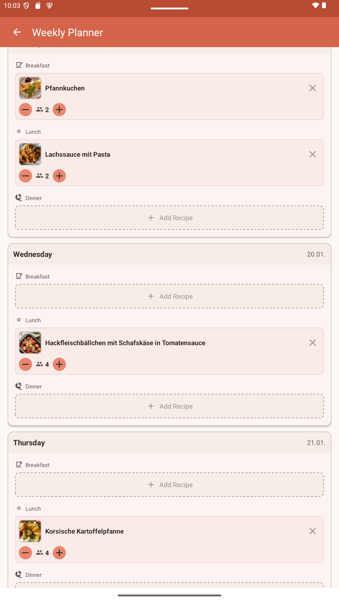
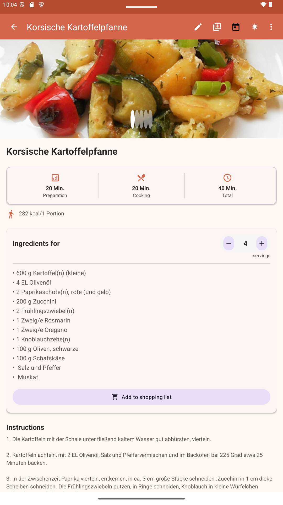
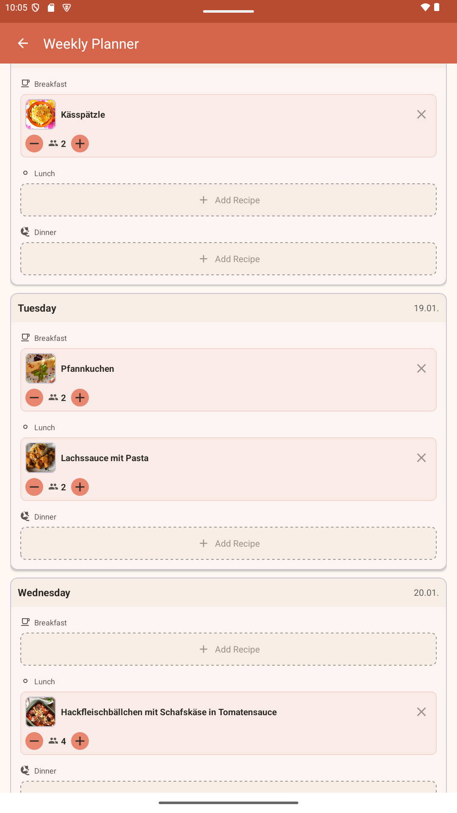

# Cookbook Android App

A native Android app as mobile frontend for the Cookbook web application.

## 📱 Screenshots

<details>
<summary>Show Screenshots</summary>

### Recipe List
Browse through all your recipes with category and collection filters. The clean card-based grid layout provides quick access to all your favorite dishes.



### Recipe Detail
View full recipe details with an image carousel, ingredients with serving calculator, step-by-step instructions, and quick actions to add to weekly planner or edit.



### Weekly Planner
Plan your meals for the entire week with breakfast, lunch, and dinner slots for each day. Adjust servings per meal and generate an aggregated shopping list.



</details>

## Features

- 🔐 **Authentication**: Login with username/password or Google Sign-In
- 🔒 **2FA Support**: Two-factor authentication
- 📖 **Recipe List**: Clear display of all recipes with category filtering
- 🔍 **Search**: Search through recipes
- 📝 **Create/Edit Recipes**: Create new recipes and edit existing ones
- 🌐 **Recipe Import**: Automatically import recipes from URLs
- 📤 **Share**: Share recipes with others
- 📅 **Weekly Planner**: Plan meals for the week with ingredient list
- ⚙️ **Server URL Configuration**: Configure your server URL at first login

## Prerequisites

- Android Studio (Arctic Fox or newer)
- Android SDK 26+ (Min SDK)
- Android SDK 34 (Target/Compile SDK)
- Kotlin 1.9+
- A running Cookbook backend

## Setup

### 1. Clone Repository

```bash
git clone https://github.com/your-username/cookbook-android.git
cd cookbook-android
```

### 2. Create Configuration File

The app requires a `local.properties` file in the project root.

**Copy the example file:**

```bash
cp local.properties.example local.properties
```

**Edit `local.properties` and enter your values:**

```properties
# Android SDK (usually set automatically by Android Studio)
sdk.dir=/path/to/your/Android/Sdk

# Google Sign-In Client ID (optional, for Google login)
GOOGLE_CLIENT_ID=your-google-client-id.apps.googleusercontent.com
```

> ⚠️ **Important**: The `local.properties` file contains sensitive data and is ignored by Git. Never commit this file!

### 3. Configure Google Sign-In (optional)

For Google Sign-In, you need to create a Google Cloud Console OAuth Client ID:

1. Go to [Google Cloud Console](https://console.cloud.google.com/)
2. Create a new project or select an existing one
3. Enable the "Google Sign-In API"
4. Go to "Credentials" → "Create Credentials" → "OAuth Client ID"
5. Create a **Web Application** Client ID (for the backend)
6. Create an **Android** Client ID:
   - Package Name: `com.cookbook.app`
   - SHA-1 fingerprint of your debug keystore:
     ```bash
     keytool -list -v -keystore ~/.android/debug.keystore -alias androiddebugkey -storepass android -keypass android
     ```
7. Enter the **Web Client ID** in `local.properties`:
   ```properties
   GOOGLE_CLIENT_ID=your-web-client-id.apps.googleusercontent.com
   ```

### 4. Server URL Configuration

The server URL is configured at runtime during the first app launch. When you start the app for the first time, you will be prompted to enter your Cookbook server API URL.

**Example URLs:**
- `https://cookbook.example.com/api` - External access via reverse proxy
- `https://192.168.1.100:3003/api` - Direct local network access

The URL is stored in the app settings and persists across sessions. You can change it later by tapping the edit button on the login screen.

### 5. Build and Run

**Via Gradle:**
```bash
./gradlew assembleDebug
```

**Via Android Studio:**
- Open the project in Android Studio
- Run → Run 'app'

## Project Structure

```
app/src/main/
├── java/com/cookbook/app/
│   ├── CookbookApplication.kt      # Application class
│   ├── data/
│   │   ├── api/                    # Retrofit API definitions
│   │   ├── auth/                   # Token management
│   │   ├── models/                 # Data models
│   │   └── repository/             # Repository pattern
│   ├── ui/
│   │   ├── adapter/                # RecyclerView adapters
│   │   ├── LoginActivity.kt        # Login screen with server setup
│   │   ├── MainActivity.kt         # Recipe list
│   │   ├── RecipeDetailActivity.kt # Recipe details
│   │   ├── RecipeEditActivity.kt   # Create/edit recipe
│   │   ├── RecipeImportActivity.kt # Import recipe
│   │   └── WeeklyPlannerActivity.kt # Weekly planner
│   └── util/                       # Utility functions
└── res/
    ├── drawable/                   # Icons and graphics
    ├── layout/                     # XML layouts
    ├── menu/                       # Menu definitions
    └── values/                     # Strings, colors, themes
```

## API Endpoints

The app communicates with the Cookbook backend through the following endpoints:

### Authentication
- `POST /auth/login` - Login with username/password
- `POST /auth/google` - Google login
- `GET /auth/me` - Current user

### Recipes
- `GET /recipes` - All recipes (paginated)
- `GET /recipes/:id` - Single recipe
- `POST /recipes` - Create recipe
- `PUT /recipes/:id` - Update recipe
- `DELETE /recipes/:id` - Delete recipe
- `POST /import` - Import recipe from URL

### Categories & Collections
- `GET /categories` - All categories
- `GET /collections` - All collections

### Weekly Planner
- `GET /mealplans/:weekStart` - Get weekly plan
- `PUT /mealplans/:weekStart/slots/:day/:mealType` - Set meal
- `DELETE /mealplans/:weekStart/slots/:day/:mealType` - Remove meal
- `POST /mealplans/:weekStart/sent-ingredients` - Mark ingredients as sent

## Technologies

- **Kotlin** - Programming language
- **Retrofit** - HTTP client
- **Coil** - Image loading
- **Material Design 3** - UI components
- **DataStore** - Persistent data storage
- **Coroutines** - Asynchronous programming
- **Google Credential Manager** - Google Sign-In

## Troubleshooting

### Build error: "local.properties not found"
Make sure you have copied `local.properties.example` to `local.properties` and filled in the values.

### Google Sign-In doesn't work
- Check if the Web Client ID is correctly entered in `local.properties`
- Make sure the SHA-1 fingerprint in Google Cloud Console is correct
- The backend must also be configured for Google Auth

### Connection errors
- Check if the API URL is correct (including `/api` at the end)
- Make sure the backend is running and reachable
- For self-signed certificates: the app accepts them automatically

### Need to change server URL
Tap the edit button (pencil icon) on the login screen to change the server URL.

## License

MIT License - see [LICENSE](LICENSE)
